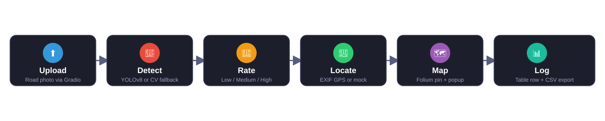
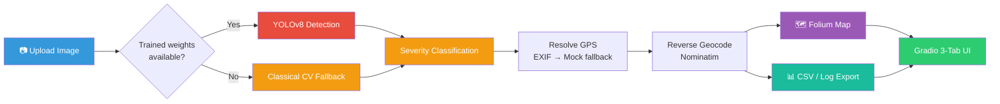
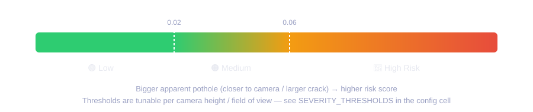
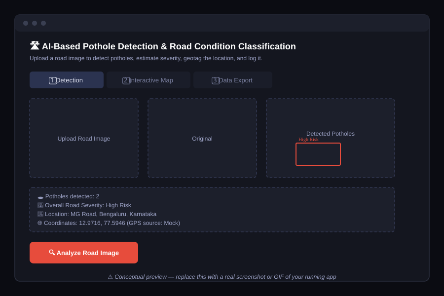

<div align="center">


[](https://colab.research.google.com/github/YOUR_USERNAME/YOUR_REPO_NAME/blob/main/notebooks/AI_Pothole_Detection_RoadCondition_Classifier.ipynb)


**Upload a road photo → detect potholes → rate severity → geotag it → drop a pin on a map → log it to a report.**

</div>

---

## 📑 Table of Contents

- [Overview](#-overview)
- [Features](#-features)
- [Pipeline](#-pipeline)
- [Architecture](#-architecture)
- [Severity Scale](#-how-severity-is-calculated)
- [Tech Stack](#-tech-stack)
- [Demo Preview](#-demo-preview)
- [Project Structure](#-project-structure)
- [Getting Started](#-getting-started)
- [Using Your Own Trained Model](#-using-your-own-trained-model)
- [Limitations](#-current-limitations)
- [Roadmap](#-roadmap)
- [License](#-license)

---

## 📌 Overview

This project is a GPU-accelerated computer-vision pipeline for automated road-condition surveying, packaged as a single self-contained Google Colab notebook.

> **Design highlight:** the pipeline is **model-agnostic**. It runs end-to-end today on a classical OpenCV heuristic detector, and the moment trained YOLOv8 weights are dropped in, it automatically switches to real detection — with zero other code changes. Demoable on day one, with a clean upgrade path to production accuracy.

## ✨ Features

| | |
|---|---|
| 🎯 **Detection** | YOLOv8 object detection, with a transparent classical-CV fallback when no trained weights exist |
| 🚦 **Severity Rating** | Automatic Low / Medium / High Risk classification from bounding-box area |
| 📍 **Geolocation** | EXIF GPS extraction first, realistic mock-GPS fallback second |
| 🗺️ **Interactive Mapping** | Folium map with severity-coded pins and address popups |
| 📊 **Reporting** | Every scan logged to a running table, exportable as CSV |
| 🖥️ **Web App** | 3-tab Gradio UI (Detection / Map / Data Export) — one button drives all three |

## 🔄 Pipeline



## 🏗️ Architecture



## 📐 How Severity Is Calculated



## 🧰 Tech Stack

| Stage | Technology | Output |
|---|---|---|
| Object Detection | YOLOv8 (Ultralytics) | Bounding boxes around potholes |
| Severity Estimation | Bounding-box-area heuristic | Low / Medium / High Risk |
| Geolocation | EXIF GPS → mock-GPS fallback | Latitude / Longitude |
| Reverse Geocoding | Geopy + OpenStreetMap Nominatim | Human-readable street address |
| Interactive Mapping | Folium | Pin-drop map with severity popup |
| Reporting | Pandas → CSV | Downloadable survey log |
| UI | Gradio (`gr.Blocks`, 3 tabs) | End-to-end web app |

## 🖼️ Demo Preview

<div align="center">



<sub>Conceptual preview of the running app — swap this for a real screenshot or GIF once you've run the notebook. Drop it in <code>assets/</code> and update the image link above.</sub>

</div>

## 📁 Project Structure

```
pothole-detection/
├── notebooks/
│   └── AI_Pothole_Detection_RoadCondition_Classifier.ipynb   # main notebook
├── assets/                                                    # banner, diagrams, screenshots
├── docs/
│   └── ARCHITECTURE.md                                        # section-by-section notebook notes
├── requirements.txt
├── LICENSE
└── README.md
```

## 🚀 Getting Started

### Option 1 — Google Colab (recommended)
Click the badge at the top of this README, then in Colab go to `Runtime → Change runtime type → Hardware accelerator → GPU (T4)`, and run the cells top to bottom.

### Option 2 — Local

```bash
git clone https://github.com/YOUR_USERNAME/YOUR_REPO_NAME.git
cd YOUR_REPO_NAME
pip install -r requirements.txt
jupyter notebook notebooks/AI_Pothole_Detection_RoadCondition_Classifier.ipynb
```

> A CUDA-capable GPU is recommended but not required — the pipeline runs on CPU too, just slower.

## 🧠 Using Your Own Trained Model

1. Fine-tune YOLOv8 on a labeled pothole dataset (see Section 3B in the notebook — includes a ready-made Roboflow template).
2. Save the resulting weights as `pothole_yolov8_best.pt`.
3. Place the file at the `MODEL_PATH` set in the notebook's config cell, then re-run the model-loading cell.
4. The pipeline automatically switches from the classical CV fallback to real YOLOv8 inference — no other cells need to change.

## ⚠️ Current Limitations

- Without custom weights, detection runs on a classical CV heuristic, not a trained model — real-world accuracy is modest until trained on real pothole imagery.
- Mock GPS is used only when EXIF GPS is absent (true for most consumer/downloaded images) — treat it as illustrative, not survey-grade.
- The in-memory detection log resets when the runtime restarts; a persistent deployment should use a database instead of a local CSV.

## 🗺️ Roadmap

- [ ] Train YOLOv8 / YOLOv8-seg on a labeled pothole dataset
- [ ] Calibrate severity against real camera height/focal length instead of raw box area
- [ ] Feed real GPS from phone/dashcam telemetry; support video frame batches
- [ ] Move storage from local CSV to PostGIS / TimescaleDB for a city-wide dashboard
- [ ] Export the trained model to ONNX/TensorRT for edge deployment (e.g. Jetson)

## 📄 License

This project is licensed under the MIT License — see [LICENSE](LICENSE) for details.

---

<div align="center">
<sub>Built by <b>Kanigelpula Suchitra</b>
</div>
